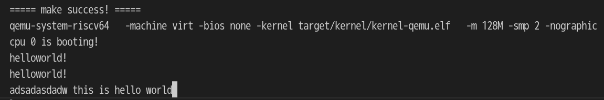

# lab-4 第一个用户进程的诞生
## 0.代码组织结构
```
ECNU-OSLAB-2025-TASK
├── LICENSE        开源协议
├── .vscode        配置了可视化调试环境
├── registers.xml  配置了可视化调试环境
├── .gdbinit.tmp-riscv xv6自带的调试配置
├── common.mk      Makefile中一些工具链的定义
├── Makefile       编译运行整个项目
├── kernel.ld      定义了内核程序在链接时的布局 (CHANGE, 支持trampsec)
├── pictures       README使用的图片目录 (CHANGE, 日常更新)
├── README.md      实验指导书 (CHANGE, 日常更新)
└── src            源码
    ├── kernel     内核源码
    │   ├── arch   RISC-V相关
    │   │   ├── method.h
    │   │   ├── mod.h
    │   │   └── type.h
    │   ├── boot   机器启动
    │   │   ├── entry.S
    │   │   └── start.c
    │   ├── lock   锁机制
    │   │   ├── spinlock.c
    │   │   ├── method.h
    │   │   ├── mod.h
    │   │   └── type.h
    │   ├── lib    常用库
    │   │   ├── cpu.c (CHANGE, 新增myproc函数)
    │   │   ├── print.c
    │   │   ├── uart.c
    │   │   ├── utils.c
    │   │   ├── method.h (CHANGE, 新增myproc函数)
    │   │   ├── mod.h
    │   │   └── type.h (CHANGE, 扩充CPU结构体 + 帮助)
    │   ├── mem    内存模块
    │   │   ├── pmem.c
    │   │   ├── kvm.c (TODO, 增加内核页表的映射内容 trampoline + KSTACK(0))
    │   │   ├── method.h
    │   │   ├── mod.h
    │   │   └── type.h
    │   ├── trap   陷阱模块
    │   │   ├── plic.c
    │   │   ├── timer.c
    │   │   ├── trap_kernel.c (CHANGE, 去掉了提示信息的static标记)
    │   │   ├── trap_user.c (TODO, 用户态陷阱处理)
    │   │   ├── trap.S
    │   │   ├── trampoline.S
    │   │   ├── method.h (CHANGE, 增加函数定义)
    │   │   ├── mod.h
    │   │   └── type.h
    │   ├── proc   进程模块
    │   │   ├── proc.c (TODO, 进程管理核心逻辑)
    │   │   ├── swtch.S (NEW, 上下文切换)
    │   │   ├── method.h (NEW)
    │   │   ├── mod.h (NEW)
    │   │   └── type.h (NEW)
    │   └── main.c (CHANGE, 日常更新)
    └── user       用户程序
        ├── initcode.c (NEW)
        ├── sys.h (NEW)
        ├── syscall_arch.h (NEW)
        └── syscall_num.h (NEW)
```

## 实现总结

### 修改文件清单

| 文件                            | 修改内容                                                 |
| ------------------------------- | -------------------------------------------------------- |
| `src/kernel/mem/kvm.c`          | `kvm_init()` 新增 TRAMPOLINE + KSTACK(0) 映射            |
| `src/kernel/proc/proc.c`        | 实现 `proc_pgtbl_init()` + `proc_make_first()`           |
| `src/kernel/trap/trap_user.c`   | 实现 `trap_user_handler()` + `trap_user_return()`        |
| `src/kernel/trap/trap_kernel.c` | 去掉 `interrupt_info` 的 `static`（供 trap_user.c 引用） |

### 详细实现

#### 1. kvm.c — 内核页表扩展映射

参照 xv6 `kvminit()`，在 `kvm_init()` 末尾新增两项映射：

- **TRAMPOLINE 页**：将 trampoline.S 代码页映射到虚拟地址 `TRAMPOLINE`（`VA_MAX - PGSIZE`），权限 `PTE_R | PTE_X`。该页是内核<->用户切换的公共代码，在用户页表和内核页表中**恒等映射**到同一虚拟地址。
- **KSTACK(0) 页**：分配一个内核物理页，映射到 `KSTACK(0)`（`TRAPFRAME - 2*PGSIZE`），权限 `PTE_R | PTE_W`，作为进程 0 的内核栈。

```c
vm_mappages(kernel_pgtbl, TRAMPOLINE, (uint64)trampoline, PGSIZE, PTE_R | PTE_X);
uint64 kstack0_pa = (uint64)pmem_alloc(true);
vm_mappages(kernel_pgtbl, KSTACK(0), kstack0_pa, PGSIZE, PTE_R | PTE_W);
```

#### 2. proc.c — 用户页表初始化 (`proc_pgtbl_init`)

参照 xv6 `proc_pagetable()`：分配一个物理页作为用户页表根，在其中映射：
- **trampoline**：`TRAMPOLINE` VA → trampoline 物理页，`PTE_R | PTE_X`（无 PTE_U，仅 supervisor 使用）
- **trapframe**：`TRAPFRAME` VA → 传入的 trapframe 物理页，`PTE_R | PTE_W`（无 PTE_U）

#### 3. proc.c — 第一个用户进程 (`proc_make_first`)

参照 xv6 `userinit()` + `allocproc()`，按以下流程创建 proczero：

1. 分配 trapframe 物理页（内核内存）并清零
2. 调用 `proc_pgtbl_init()` 创建用户页表
3. 设置内核栈 VA = `KSTACK(0)`
4. 分配用户栈：`TRAPFRAME - PGSIZE`，1 页，权限 `PTE_R | PTE_W | PTE_U`
5. 加载 initcode：分配物理页映射到 `USER_BASE`，权限 `PTE_R | PTE_W | PTE_X | PTE_U`，`memmove` 拷贝代码
6. 设置 `heap_top = USER_BASE + PGSIZE`，`user_to_kern_epc = USER_BASE`
7. 设置 `mycpu()->proc = &proczero`
8. 调用 `trap_user_return()` 切入用户态

用户地址空间布局：
```
TRAMPOLINE   ─── 最高虚拟地址
TRAPFRAME    ─── trapframe 页
ustack       ─── 用户栈 (1 页)
  ...
heap_top     ─── USER_BASE + PGSIZE
code + data  ─── USER_BASE (initcode)
guard page   ─── 0 (不映射)
```

#### 4. trap_user.c — 用户态陷阱处理 (`trap_user_handler`)

参照 xv6 `usertrap()`：

1. 读取 sepc/sstatus/scause，验证 `SPP == 0`（来自 U-mode）
2. 保存 `sepc` → `p->tf->user_to_kern_epc`
3. 切换 `stvec` → `kernel_vector`（内核态陷阱由 kernel_vector 处理）
4. 中断处理（trap_id=1 软件中断/时钟, trap_id=9 外设中断）
5. 异常处理：trap_id=8（ecall 系统调用）：
   - 从 `p->tf->a7` 读取系统调用号
   - `SYS_helloworld` → `printf("helloworld\n")`，`a0 = 0`
   - `user_to_kern_epc += 4`（跳过 ecall 指令）
6. 调用 `trap_user_return()` 返回用户态

#### 5. trap_user.c — 返回用户态 (`trap_user_return`)

参照 xv6 `usertrapret()`：

1. 关中断 `intr_off()`
2. 设置 `stvec` → `TRAMPOLINE + (user_vector - trampoline)`（用户态陷阱入口）
3. 填充 trapframe 内核字段：satp、sp、trapvector、hartid
4. 设置 `sstatus`：清除 SPP（→User mode），设置 SPIE
5. `w_sepc(p->tf->user_to_kern_epc)` → 设置用户返回地址
6. 通过函数指针调用 trampoline 中的 `user_return(TRAPFRAME, satp)`：
   - 切换用户页表 → 恢复用户寄存器 → `sret` 到 U-mode

### 执行流程

```
boot → main() → kvm_init() → kvm_inithart() → trap_kernel_init()
    → trap_kernel_inithart() → proc_make_first()
        → 创建 proczero (页表/栈/initcode)
        → trap_user_return() → user_return (trampoline.S) → sret → U-mode
            → initcode 执行 ecall (SYS_helloworld)
            → user_vector (trampoline.S) → trap_user_handler()
                → printf("helloworld")
                → trap_user_return() → sret → U-mode
                    → initcode 继续执行...
```
测试结果：
