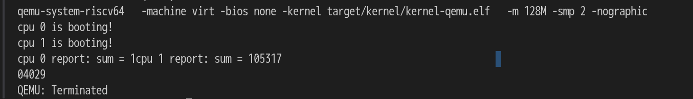
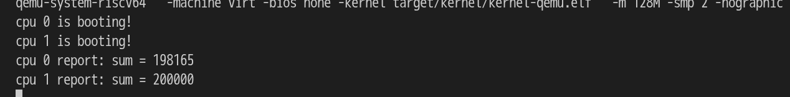

# lab-1 机器启动
## 0.代码组织结构
```
LAB1
├── LICENSE        开源协议  
├── .vscode        配置了可视化调试环境
├── registers.xml  配置了可视化调试环境  
├── Makefile       编译运行整个项目  
├── common.mk      Makefile中一些工具链的定义  
├── kernel.ld      定义了内核程序在链接时的布局  
├── pictures       README使用的图片目录  
├── README.md      实验指导书  
└── src            源码
    └── kernel     内核源码
        ├── arch   RISC-V相关
        │   ├── method.h  
        │   ├── mod.h  
        │   └── type.h  
        ├── boot   机器启动
        │   ├── entry.S  
        │   └── start.c (DONE)  
        ├── lock   锁机制
        │   ├── spinlock.c (DONE)  
        │   ├── method.h  
        │   ├── mod.h  
        │   └── type.h  
        ├── lib    常用库
        │   ├── cpu.c  
        │   ├── print.c (DONE)  
        │   ├── uart.c  
        │   ├── method.h  
        │   ├── mod.h  
        │   └── type.h  
        └── main.c (DONE)  
```
## 1.编译及配置相关
    archlinux及macos会在配置时可能会遇到以下问题
### 1.1 sh.c出错
    循环递归造成错误,修改sh.c的第一个函数为其加上__attribute__((noreturn))
### 1.2 运行时进不了main函数
    start.c中加入如下代码
```
    // 配置物理内存保护，使监督者模式
    // 能够访问所有物理内存。
    w_pmpaddr0(0x3fffffffffffffull);
    w_pmpcfg0(0xf);
```
## 2.printf
### 加锁前


### 加锁后


